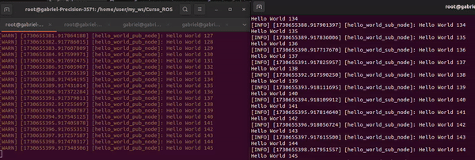

<!-- Shields Section--><!-- Optional -->

<!-- 
* Insert project shields and badges through this link https://shields.io/
* 
*
-->

<div align="center">
    <a href="https://github.com/gabrielhvs/ros2_cpp_learning/blob/main/LICENSE"></a>
    <a href="https://github.com/gabrielhvs/ros2_cpp_learning/stargazers"></a>
    <a href="https://github.com/gabrielhvs/ros2_cpp_learning/issues"></a>
    <a href="https://github.com/gabrielhvs/ros2_cpp_learning/network"></a>
</div>
<br>


<!-- Logo Section  --><!-- Required -->

<!--
* Insert an image URL in the  "src" attribute bellow. (line )
* 
* Insert your github profile URL in the <a> "href" attribute bellow (line )
-->


<div align="center">
    <a href="https://github.com/gabrielhvs/ros2_cpp_learning" target="_blank">
        
    </a>
</div>


<!-- Project title 
* use a dynamic typing-SvG here https://readme-typing-svg.demolab.com/demo/
*
*  Instead you can type your project name after a # header
-->

<div align="center">

</div>


## About<!-- Required -->
<!-- 
* information about the project 
* 
* keep it short and sweet
-->


This repository contains examples and resources to use in future projects with ROS2 midware and C++ language.


<!--## How to use this project Required -->
<!-- 
* Here you may add information about how 
* 
* and why to use this project.


- Access the [Blank template](./Templates/_blank-README.md) to use for your projects. 
- clone this repository into your local machine.

```bash
    git clone https://github.com/gabrielhvs/ros2_cpp_learning.git
```
- You can copy the markdown directly from this [MD file](./Templates/markdown-only.md).
- Make sure to check the [Documentation](https://github.com/gabrielhvs/ros2_cpp_learning/wiki/Step-by-Step-Guide) for a step by step guide.
- Support me by staring this repository 
-->

## Demo<!-- Required -->
<!-- 
* You can add a demo here GH supports images/ GIFs/videos 
* 
* It's recommended to use GIFs as they are more dynamic
-->


<div align="center">
    
</div>

## Table of Contents<!-- Optional -->
<!-- 
* This section is optional, yet having a contents table 
* helps keeping your README readable and more professional.
* 
* If you are not familiar with HTML, no worries we all been there :) 
* Review learning resources to create anchor links. 
-->


<dev display="inline-table" vertical-align="middle">
<table align="center" vertical-align="middle">
        <tr>
            <td><a href="#about">About</a></td>        
            <!--<td><a href="#how-to-use-this-project">Getting started</td>-->
            <td><a href="#demo">Demo</a></td>
           <!-- <td><a href="#project-roadmap--">Project Roadmap</a></td>-->
            <td><a href="#useful-commands">Useful commands</a></td>
        </tr>
        <tr>
            <td><a href="#acknowledgments">Acknowledgments</a></td>
            <!--<td><a href="https://github.com/gabrielhvs/ros2_cpp_learning/tree/main/Learning_Resources">Learning Resources</a></td>-->
            <!--<td><a href="https://github.com/gabrielhvs/ros2_cpp_learning/wiki/Step-by-Step-Guide">
            Step By Step Guide</a></td>-->
            <!--<td><a href="#feedback">Feedback</a></td>-->
            <td><a href="#contributors">Contributors</a></td>
            <td><a href="#feedback">Feedback</a></td>
            <td><a href="#contact">Contact</a></td>
            <!--<td><a href="#license">License</a></td>-->
        </tr>
</table>
</dev>


<!-- - Use this html element to create a back to top button. -->
<p align="right"><a href="#about">back to top ⬆️</a></p>


## Useful commands<!-- Optional -->
<!-- 
* You may add any documentation or Wikis here
* 
* 
-->


### Debug in ros

```c++
sudo apt-get install gdbserver

ros2 run --prefix 'gdbserver loaclhast:3000' package app
```
### To no generate double files in build 
```c++
colcon build --symlink-install
```

### List interfaces
```c++
ros2 inteface list // to list all messages, actions and services types
```
### Work with parameters
```c++
ros2 param list // lista os parametros de cada nó do sistema
ros2 param get <Node> <Param>
ros2 param describe <Node> <Param>
ros2 param set <Node> <Param> <value>

ros2 node list -> list all nodes in system

ros2 launch <pkg_name> <launch_file> // run project using launch.py
```
### Services
```c++
ros2 interface list
ros2 service list
ros2 service call <service_name> <srv_type> <req>
```
### Using OpenCV

#### Include OpenCV
```c++
#include <opencv2/imgcodecs.hpp>
#include <opencv2/highgui.hpp>
#include <opencv2/cv_bridge.hpp>
```
#### Read In Image From File
```c++
auto image = cv::imread("/path/to/image.png");
```
#### Display Image In OPenCV Window
```c++
cv::imshow("Robot Camera Image", image);
cv::waitKey(0);
```
#### Converting OpenCV image to Ros Image Interface
```c++
auto image_msg_ptr = cv_bridge::CvImage(
    std_msgs::msg::Header(), "brg8", image).toImageMsg();
image_msg = *imate_ptr;
```
#### Converting Ros Image Interface To OpenCV Image
```c++
auto cv_ptr = cv_bridge::toCvCopy(result.get()->response_attr_name, "brg8");
image = cv_ptr->image;
```
#### Using Interfaces from other ROS Package in Custom Interface
```c++
sensor_msgs/Image request_attr_name
```
#### Add Ros IDL Dependencies In CMakeLists.txt
```c++
rosidl_generate_interfaces(${PROJECT_NAME}
    "srv/YourSrvName.srv"
    DEPENDENCIES
    sensor_msgs
)

sudo apt install ros-$ROS_DISTRO-cv-brigde
```
### Install Third Packages
```c++
sudo apt install ros-$ROS_DISTRO-usb-cam
```
### Log using Ros2
```c++
ros2 bag record \topic_name 

ros2 bag record -a 

ros2 bag record -o name_of_log

ros2 bag player name_of_log
```
### Using Gazebo
```c++
sudo apt install ros-$ROS_DISTRO-ros-ign-brigde

ign gazebo

ign gazebo name_of_model

ign topic -l 

ros2 run ros_ign_brigde paramter_brigde ...

export IGN_GAZEBO_RESOURCE_PATH = path_contens_constom_model
```
## Contributors<!-- Required -->
<!-- 
* Without contribution we wouldn't have open source. 
* 
* Generate github contributors Image here https://contrib.rocks/preview?repo=angular%2Fangular-ja
-->

<a href="https://github.com/gabrielhvs/ros2_cpp_learning/graphs/contributors">
  
</a>


## Acknowledgments<!-- Optional -->
<!-- 
* Credit where it's do 
* 
* Feel free to share your inspiration sources, Stackoverflow questions, github repos, tools etc.
-->

- [ROS 2 Documentation](https://docs.ros.org/en/foxy/index.html)


<!-- - Use this html element to create a back to top button. -->
<p align="right"><a href="#about">back to top ⬆️</a></p>


## Feedback<!-- Required -->
<!-- 
* You can add contacts information like your email and social media account 
* 
* Also it's common to add some PR guidance.
-->


> You can make this project better, please  feel free to open a [Pull Request](https://github.com/gabrielhvs/ros2_cpp_learning/pulls).
- If you notice a bug or a typo use the tag **"Correction"**.
- If you want to share any ideas to help make this project better, use the tag **"Enhancement"**.

<details>
    <summary>Contact Me 📨</summary>

### Contact<!-- Required -->
Reach me via email: [gabbrielvasc@gmail.com](mailto:gabbrielvasc@gmail.com)
<!-- 
* add your email and contact info here
* 
* 
-->
    
</details>

<!-- - Use this html element to create a back to top button. -->
<p align="right"><a href="#about">back to top ⬆️</a></p>
